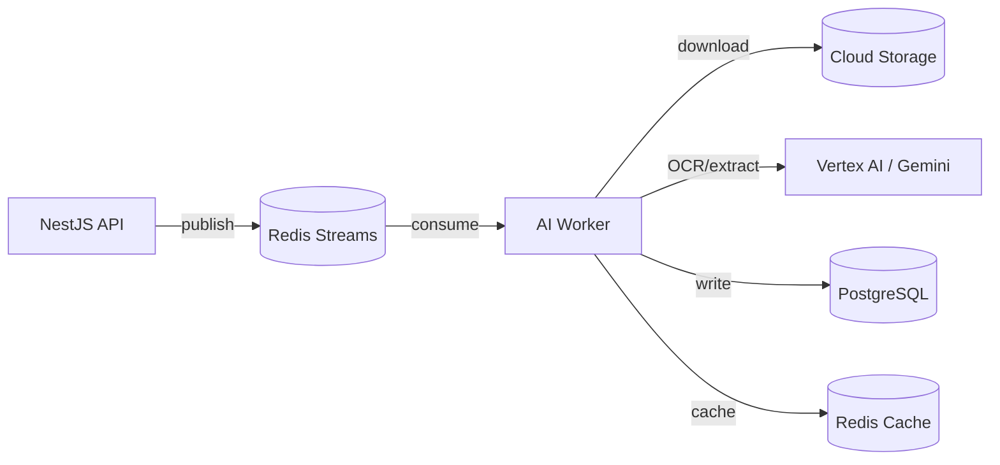

# AI Architecture

## 1. Principles

1. **No training on customer data**: All prompts and responses are ephemeral; model providers must not retain or train on inputs.
2. **Pluggable providers**: Abstract `AIProvider` interface supports Google Gemini, OpenAI, AWS Bedrock, and self-hosted models.
3. **Human in the loop**: Extracted data is editable; summaries are clearly marked AI-generated.
4. **Observability**: Track latency, cost, confidence, and failure rates; no PII in telemetry.
5. **Privacy by design**: PII redacted from logs; processing inside VPC where possible.

## 2. AI service (`services/ai`)

A separate NestJS or Python worker service that consumes Redis Streams events and processes documents asynchronously.



## 3. Provider interface (pseudocode)

```typescript
interface AIProvider {
  // Convert image/PDF to structured text
  ocr(fileBuffer: Buffer, mimeType: string): Promise<OcrResult>;

  // Classify document category
  classify(text: string, mimeType: string): Promise<DocumentCategory>;

  // Extract entities into normalized schema
  extractEntities(text: string, visitContext: VisitContext): Promise<ExtractedEntity[]>;

  // Generate summaries
  summarizeVisit(visit: Visit, documents: Document[]): Promise<string>;
  summarizePerson(person: Person, timeline: TimelineEvent[]): Promise<string>;

  // Embed text for semantic search
  embed(text: string): Promise<number[]>;

  // Natural language to structured query
  nlToQuery(query: string, filters: QueryFilters): Promise<StructuredQuery>;

  // Detect duplicates
  detectDuplicates(document: Document, candidates: Document[]): Promise<Duplicate[]>;
}
```

## 4. Document processing pipeline

1. **Preprocessing**: Convert HEIC to JPEG, PDF to images, downsample if needed.
2. **OCR**: Extract raw text and bounding boxes.
3. **Classification**: Map to `document_category`.
4. **Entity extraction**: Doctor, hospital, dates, diagnoses, medications, lab tests, billing.
5. **Normalization**: Dates -> ISO, medication names -> standard vocabulary, amounts -> decimal.
6. **Summary generation**: Per-document and per-visit summaries.
7. **Timeline generation**: Insert/update `timeline_events`.
8. **Embedding generation**: Store in `document_embeddings` for semantic search.
9. **Duplicate detection**: Compare SHA-256 and perceptual hash (pHash).
10. **Status update**: Mark document `ai_status = completed` or `failed`.

## 5. Prompt engineering & safety

- Prompts stored in version-controlled templates (`services/ai/prompts/`).
- Output parsed with Zod/JSON schemas; invalid output retried with fallback.
- System prompt explicitly instructs: "Do not add information not present in the document."
- No medical advice, diagnosis, or treatment recommendations generated.

## 6. Privacy controls

- All AI calls routed through a dedicated VPC egress.
- Data processing addendum with Google Cloud (Vertex AI).
- Prompts/responses not logged; only metadata (token count, latency, error code) logged.
- PII masked in metrics (no names, no medical details).
- AI result caching with non-PII keys (document hash + prompt version).

## 7. Natural language search

- Simple queries: parsed into PostgreSQL FTS + filters.
- Complex queries: sent to LLM with a constrained schema to produce `StructuredQuery`.
- Semantic search: use `pgvector` and document embeddings.
- Hybrid ranking: combine FTS score + cosine similarity + recency.

## 8. Duplicate detection

- **Exact duplicate**: compare `checksum_sha256`.
- **Near-duplicate**: compute perceptual hash (`pHash`) on images; for PDFs, compare normalized OCR text or embeddings.
- Store fingerprints in `document_fingerprints` table.
- Surface duplicates to user with confidence score.

## 9. Failure handling

- Retry with exponential backoff (max 3).
- Dead-letter queue for failed documents.
- Manual retry endpoint in admin dashboard.
- Fallback to manual metadata entry if AI fails.

## 10. Monitoring

- Latency p95/p99 per provider and model.
- Token usage and cost per family (for billing/quotas).
- Error rate by stage (OCR, classify, extract, summarize).
- Human correction rate (feedback signal for prompt improvement).