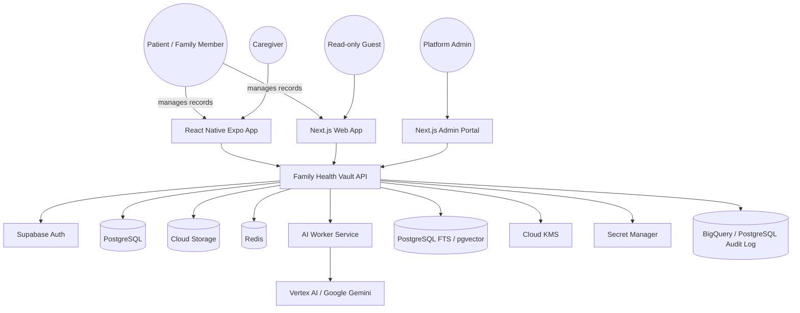
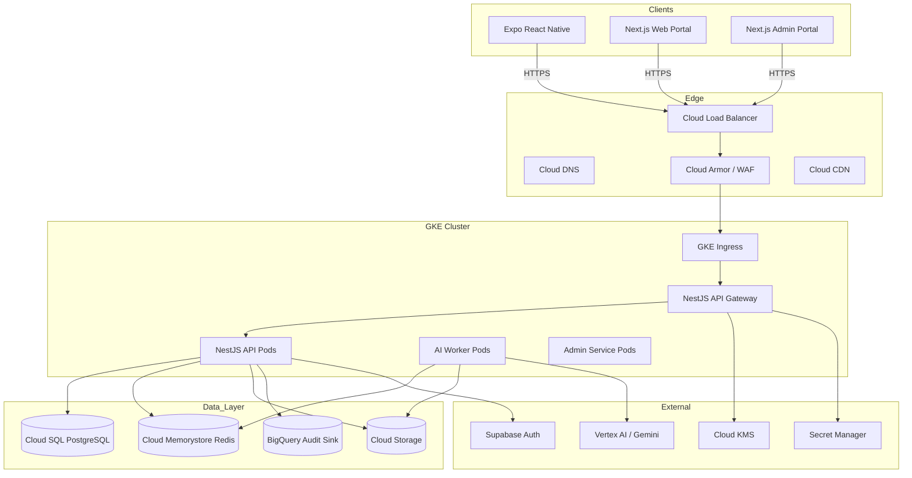

# System Architecture

## 1. Design principles

1. **Tenant-first**: Every family is a tenant. Every query must be scoped by `family_id`.
2. **Defense in depth**: RLS + application-level authorization + service mesh + WAF.
3. **Privacy by design**: Encryption at rest/transit, audit logs, consent, data export, erasure.
4. **AI-ready but safe**: Pluggable AI providers; no model training on customer data.
5. **Offline-first mobile**: Local cache + background sync.
6. **Scale-out**: Stateless services, async processing, read replicas, CDN.
7. **Future-proof**: Extensible schema supports FHIR, DICOM, and enterprise tenants.

## 2. C4 Context Diagram



## 3. C4 Container Diagram



## 4. Core data flow

### 4.1 Document upload

1. Client calls `POST /api/v1/families/:familyId/documents/upload-url` with file metadata.
2. API validates user/family permissions.
3. API creates a `documents` row with `status = pending` and returns a signed Cloud Storage URL.
4. Client uploads the file directly to Cloud Storage.
5. Client calls `POST /api/v1/families/:familyId/documents` to confirm upload.
6. API verifies object exists and size matches, updates `status = uploaded`.
7. API publishes an event to Redis Streams (`ai:process-document`).
8. AI Worker picks up the event, downloads the file, runs OCR/classification/extraction.
9. AI Worker writes `extracted_entities`, `ai_summaries`, `tags`, and `timeline_events`.
10. AI Worker updates document `status = processed` and `ai_status = completed`.

### 4.2 Reading a document

1. Client calls `GET /api/v1/families/:familyId/documents/:documentId/download`.
2. API checks RLS permissions and any active share token.
3. API generates a short-lived signed URL for the Cloud Storage object.
4. Client downloads directly from Cloud Storage + CDN.

### 4.3 Search

1. Client calls `POST /api/v1/families/:familyId/search` with query/filters.
2. API parses query (simple keyword, structured filters, or NL->filters via AI).
3. API queries PostgreSQL FTS (`tsvector`) and/or pgvector semantic search.
4. Results ranked by relevance and permissions, paginated.
5. Cache frequent queries in Redis.

## 5. Service boundaries

| Service | Responsibility | Scaling |
|---|---|---|
| `api` | HTTP API, auth, permissions, RLS context, orchestration | HPA on CPU/memory |
| `ai` | Background document processing, OCR, extraction, summaries, embeddings | HPA + queue depth |
| `admin` | Platform admin dashboard API | HPA (low traffic) |
| `mobile` | React Native Expo app | App stores |
| `web` | Next.js patient/family portal | Server-side rendering |
| `admin-web` | Next.js admin portal | Server-side rendering |

## 6. Key entities

```text
User (Supabase identity)
  └── Membership ──> Family
                       ├── Person(s)
                       │      └── Medical Visit(s)
                       │             └── Document(s)
                       │                   ├── ExtractedEntity
                       │                   ├── AiSummary
                       │                   └── Tag
                       ├── TimelineEvent
                       ├── Share
                       ├── ConsentRecord
                       └── AuditLog
```

## 7. Security boundaries

| Boundary | Controls |
|---|---|
| Internet → Edge | TLS 1.2/1.3, Cloud Armor WAF/DDoS, rate limiting, geo-blocking if needed. |
| Edge → Cluster | mTLS via service mesh (Istio/Anthos), private GKE nodes, authorized networks. |
| Cluster → Database | Private VPC connection, IAM auth, TLS, RLS policies. |
| Cluster → Storage | Signed URLs, VPC Service Controls, bucket policies, object retention. |
| Cluster → AI | Private Google Access, no customer data in logs, data processing addendum. |
| Internal access | Role-based access, least-privilege service accounts, no direct DB access from developers. |

## 8. External integrations

### MVP
- **Supabase Auth**: JWT identity, OTP, social login.
- **Google Cloud Storage**: object storage.
- **Google Gemini / Vertex AI**: OCR and extraction.

### Future
- **ABDM**, **FHIR R4**, **HL7**, **DICOM**.
- **Google Health Connect / Apple HealthKit**.
- **Insurance / lab / hospital APIs**.
- **SAML / SCIM / Enterprise SSO**.

## 9. Scalability targets

- Stateless API pods allow horizontal scaling to handle 1M users.
- Cloud SQL read replicas for read-heavy endpoints.
- Redis cluster for sessions, rate limits, queues, and FTS result caching.
- Cloud CDN for document downloads.
- AI workers scale independently based on queue depth.
- Audit logs sink to BigQuery for long-term retention and compliance queries.
- Object lifecycle rules move old documents to Nearline/Coldline to reduce cost.