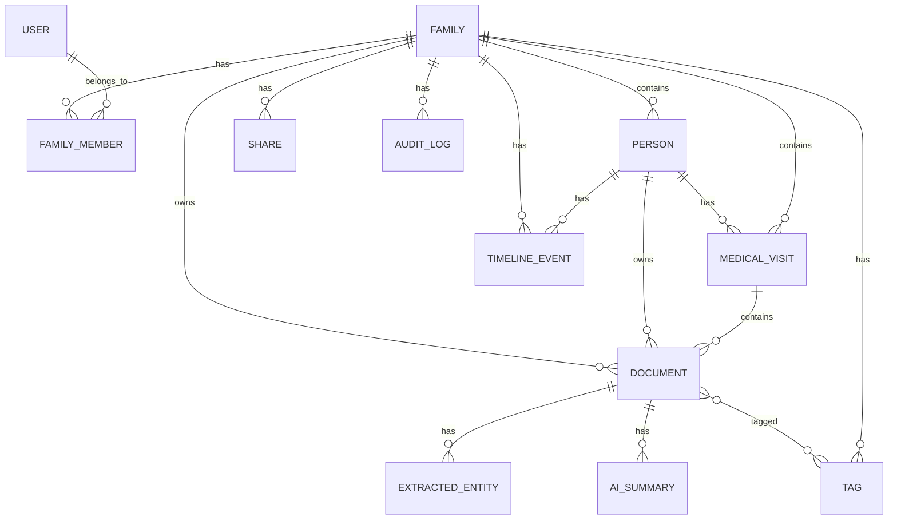

# Database Design

## 1. Overview

- **Engine**: PostgreSQL 15+
- **Tenant model**: Multi-tenant at the family level
- **Isolation**: Row Level Security (RLS) policies on every tenant-scoped table
- **Primary key type**: `uuid` (`gen_random_uuid()` from `pgcrypto`)
- **Soft delete**: `deleted_at` timestamp on all mutable tables
- **Audit**: `created_by`, `updated_by` + `audit_logs` table

## 2. Required extensions

```sql
CREATE EXTENSION IF NOT EXISTS "pgcrypto";
CREATE EXTENSION IF NOT EXISTS "pg_trgm";
CREATE EXTENSION IF NOT EXISTS "pgvector";        -- future semantic search
CREATE EXTENSION IF NOT EXISTS "btree_gin";
CREATE EXTENSION IF NOT EXISTS "citext";
```

## 3. Entity relationship



## 4. Core tables

### `users`

Mirrors Supabase Auth identity in Cloud SQL. If using Supabase hosted Postgres, this can be a view or sync table.

```sql
CREATE TABLE users (
    id uuid PRIMARY KEY DEFAULT gen_random_uuid(),
    email citext UNIQUE,
    phone text,
    auth_provider text NOT NULL,          -- google, apple, email_otp
    provider_user_id text,
    email_verified boolean DEFAULT false,
    mfa_enabled boolean DEFAULT false,
    locale text DEFAULT 'en-IN',
    timezone text DEFAULT 'Asia/Kolkata',
    created_at timestamptz DEFAULT now(),
    updated_at timestamptz DEFAULT now(),
    deleted_at timestamptz
);
```

### `families`

```sql
CREATE TABLE families (
    id uuid PRIMARY KEY DEFAULT gen_random_uuid(),
    name text NOT NULL,
    slug text UNIQUE,
    owner_id uuid REFERENCES users(id),
    plan text DEFAULT 'free',
    subscription_status text DEFAULT 'active',
    data_residency_region text DEFAULT 'in',
    created_at timestamptz DEFAULT now(),
    updated_at timestamptz DEFAULT now(),
    deleted_at timestamptz
);
```

### `family_members`

```sql
CREATE TABLE family_members (
    id uuid PRIMARY KEY DEFAULT gen_random_uuid(),
    family_id uuid NOT NULL REFERENCES families(id),
    user_id uuid REFERENCES users(id),
    person_id uuid REFERENCES persons(id),
    role text NOT NULL CHECK (role IN ('owner','admin','member','dependent','guest')),
    status text NOT NULL DEFAULT 'pending' CHECK (status IN ('pending','active','revoked')),
    invited_email citext,
    invited_phone text,
    created_at timestamptz DEFAULT now(),
    updated_at timestamptz DEFAULT now(),
    UNIQUE (family_id, user_id)
);
```

### `persons`

```sql
CREATE TABLE persons (
    id uuid PRIMARY KEY DEFAULT gen_random_uuid(),
    family_id uuid NOT NULL REFERENCES families(id),
    first_name text NOT NULL,
    last_name text,
    date_of_birth date,
    gender text,
    relationship text,                    -- self, spouse, child, parent, other
    is_primary boolean DEFAULT false,
    avatar_url text,
    created_by uuid REFERENCES users(id),
    created_at timestamptz DEFAULT now(),
    updated_at timestamptz DEFAULT now(),
    deleted_at timestamptz
);
```

### `medical_visits`

```sql
CREATE TABLE medical_visits (
    id uuid PRIMARY KEY DEFAULT gen_random_uuid(),
    family_id uuid NOT NULL REFERENCES families(id),
    person_id uuid NOT NULL REFERENCES persons(id),
    title text NOT NULL,
    visit_date date,
    doctor_name text,
    hospital_name text,
    department text,
    diagnosis_summary text,
    notes text,
    tags text[],
    source text DEFAULT 'manual',         -- manual, ai_import, fhir
    status text DEFAULT 'active',
    created_by uuid REFERENCES users(id),
    updated_by uuid REFERENCES users(id),
    created_at timestamptz DEFAULT now(),
    updated_at timestamptz DEFAULT now(),
    deleted_at timestamptz
);
```

### `documents`

```sql
CREATE TABLE documents (
    id uuid PRIMARY KEY DEFAULT gen_random_uuid(),
    family_id uuid NOT NULL REFERENCES families(id),
    person_id uuid NOT NULL REFERENCES persons(id),
    visit_id uuid REFERENCES medical_visits(id),
    file_name text NOT NULL,              -- stored file name in bucket
    original_file_name text NOT NULL,
    mime_type text NOT NULL,
    size_bytes bigint NOT NULL,
    storage_bucket text NOT NULL,
    storage_path text NOT NULL,
    checksum_sha256 text,
    encryption_key_id text,               -- KMS key version or CMK reference
    document_category text,
    ocr_text text,                        -- extracted text for FTS
    metadata jsonb,                       -- parsed AI metadata
    status text DEFAULT 'pending' CHECK (status IN ('pending','uploaded','processing','processed','failed','deleted')),
    ai_status text DEFAULT 'pending' CHECK (ai_status IN ('pending','queued','processing','completed','failed','skipped')),
    uploaded_by uuid REFERENCES users(id),
    created_at timestamptz DEFAULT now(),
    updated_at timestamptz DEFAULT now(),
    deleted_at timestamptz
);
```

### `extracted_entities`

```sql
CREATE TABLE extracted_entities (
    id uuid PRIMARY KEY DEFAULT gen_random_uuid(),
    document_id uuid REFERENCES documents(id),
    visit_id uuid REFERENCES medical_visits(id),
    person_id uuid REFERENCES persons(id),
    family_id uuid NOT NULL REFERENCES families(id),
    entity_type text NOT NULL,            -- doctor, hospital, date, diagnosis, medication, lab_test, billing_amount, etc.
    value text NOT NULL,
    normalized_value text,
    confidence float NOT NULL,
    source text DEFAULT 'ai',             -- ai, manual
    ai_model text,
    created_at timestamptz DEFAULT now()
);
```

### `ai_summaries`

```sql
CREATE TABLE ai_summaries (
    id uuid PRIMARY KEY DEFAULT gen_random_uuid(),
    family_id uuid NOT NULL REFERENCES families(id),
    person_id uuid NOT NULL REFERENCES persons(id),
    visit_id uuid REFERENCES medical_visits(id),
    document_id uuid REFERENCES documents(id),
    summary_type text NOT NULL,           -- visit, person, document, medication_history
    content text NOT NULL,
    model_name text,
    status text DEFAULT 'pending',
    generated_at timestamptz DEFAULT now(),
    created_at timestamptz DEFAULT now()
);
```

### `timeline_events`

```sql
CREATE TABLE timeline_events (
    id uuid PRIMARY KEY DEFAULT gen_random_uuid(),
    family_id uuid NOT NULL REFERENCES families(id),
    person_id uuid NOT NULL REFERENCES persons(id),
    visit_id uuid REFERENCES medical_visits(id),
    event_type text NOT NULL,             -- visit, document, lab, vaccination, medication, diagnosis
    event_date date,
    title text NOT NULL,
    description text,
    source_id uuid,
    source_type text,
    created_at timestamptz DEFAULT now()
);
```

### `shares`

```sql
CREATE TABLE shares (
    id uuid PRIMARY KEY DEFAULT gen_random_uuid(),
    family_id uuid NOT NULL REFERENCES families(id),
    resource_type text NOT NULL,          -- document, visit, person
    resource_id uuid NOT NULL,
    recipient_email citext,
    token uuid NOT NULL UNIQUE DEFAULT gen_random_uuid(),
    permission text DEFAULT 'read' CHECK (permission IN ('read')),
    expires_at timestamptz,
    access_count int DEFAULT 0,
    created_by uuid REFERENCES users(id),
    created_at timestamptz DEFAULT now()
);
```

### `audit_logs`

```sql
CREATE TABLE audit_logs (
    id uuid PRIMARY KEY DEFAULT gen_random_uuid(),
    family_id uuid REFERENCES families(id),
    user_id uuid REFERENCES users(id),
    action text NOT NULL,                 -- create, read, update, delete, share, export, login, download
    resource_type text NOT NULL,
    resource_id uuid,
    ip_address inet,
    user_agent text,
    metadata jsonb,
    created_at timestamptz DEFAULT now()
) PARTITION BY RANGE (created_at);
```

Create monthly partitions for `audit_logs` (e.g. `audit_logs_y2024m01`) to keep write performance high and enable easy archival.

### `tags` and `document_tags`

```sql
CREATE TABLE tags (
    id uuid PRIMARY KEY DEFAULT gen_random_uuid(),
    family_id uuid NOT NULL REFERENCES families(id),
    name text NOT NULL,
    color text,
    UNIQUE (family_id, name)
);

CREATE TABLE document_tags (
    document_id uuid REFERENCES documents(id) ON DELETE CASCADE,
    tag_id uuid REFERENCES tags(id) ON DELETE CASCADE,
    PRIMARY KEY (document_id, tag_id)
);
```

### `consent_records`

```sql
CREATE TABLE consent_records (
    id uuid PRIMARY KEY DEFAULT gen_random_uuid(),
    user_id uuid REFERENCES users(id),
    family_id uuid REFERENCES families(id),
    action text NOT NULL,                 -- ai_processing, data_sharing, marketing
    granted boolean NOT NULL,
    ip_address inet,
    user_agent text,
    created_at timestamptz DEFAULT now()
);
```

## 5. Search and embeddings

### Full-text search materialized view

```sql
CREATE MATERIALIZED VIEW search_documents AS
SELECT
    d.id AS document_id,
    d.family_id,
    d.person_id,
    d.visit_id,
    to_tsvector('english', coalesce(d.original_file_name,'') || ' ' ||
                           coalesce(d.ocr_text,'') || ' ' ||
                           coalesce(d.document_category,'') || ' ' ||
                           coalesce((SELECT string_agg(value, ' ') FROM extracted_entities WHERE document_id = d.id AND family_id = d.family_id), '')) AS search_vector,
    d.updated_at AS last_modified
FROM documents d
WHERE d.deleted_at IS NULL;

CREATE INDEX idx_search_documents_vector ON search_documents USING GIN (search_vector);
```

Refresh strategy: incremental refresh every minute or trigger-based update for MVP; consider `pg_search`/`paradedb` if refresh cost becomes high.

### Semantic search table

```sql
CREATE TABLE document_embeddings (
    id uuid PRIMARY KEY DEFAULT gen_random_uuid(),
    document_id uuid REFERENCES documents(id) ON DELETE CASCADE,
    embedding vector(1536),
    model_name text,
    created_at timestamptz DEFAULT now()
);

CREATE INDEX idx_document_embeddings_vector ON document_embeddings USING ivfflat (embedding vector_cosine_ops);
```

## 6. Row Level Security (RLS)

### Helper functions

```sql
CREATE OR REPLACE FUNCTION app.current_family_ids()
RETURNS uuid[] AS $$
BEGIN
    RETURN COALESCE(current_setting('app.current_family_ids', true)::uuid[], ARRAY[]::uuid[]);
EXCEPTION WHEN OTHERS THEN
    RETURN ARRAY[]::uuid[];
END;
$$ LANGUAGE plpgsql SECURITY DEFINER;

CREATE OR REPLACE FUNCTION app.current_user_id()
RETURNS uuid AS $$
BEGIN
    RETURN NULLIF(current_setting('app.current_user_id', true), '')::uuid;
EXCEPTION WHEN OTHERS THEN
    RETURN NULL;
END;
$$ LANGUAGE plpgsql SECURITY DEFINER;
```

### Example RLS policy

```sql
ALTER TABLE documents ENABLE ROW LEVEL SECURITY;

CREATE POLICY documents_family_isolation ON documents
    FOR ALL
    TO app_api
    USING (
        family_id = ANY (app.current_family_ids())
        OR family_id IN (
            SELECT family_id FROM shares s
            WHERE s.token = NULLIF(current_setting('app.current_share_token', true), '')::uuid
              AND s.expires_at > now()
        )
    )
    WITH CHECK (family_id = ANY (app.current_family_ids()));
```

All tenant tables follow the same pattern. Application role `app_api` is the only role used by the API. The API sets `app.current_user_id` and `app.current_family_ids` inside each transaction:

```sql
BEGIN;
SET LOCAL app.current_user_id = '<user_uuid>';
SET LOCAL app.current_family_ids = '{<family_uuid1>,<family_uuid2>}';
-- application queries
COMMIT;
```

### Platform admin access

Platform admins use a separate `app_admin` role with BYPASSRLS privilege, or policies explicitly check `app.current_user_role = 'platform_admin'`. This is restricted to admin-only connection pools and endpoints.

## 7. Indexes

```sql
-- families
CREATE UNIQUE INDEX idx_families_slug ON families(slug) WHERE deleted_at IS NULL;

-- family_members
CREATE UNIQUE INDEX idx_family_members_user ON family_members(family_id, user_id) WHERE user_id IS NOT NULL;
CREATE INDEX idx_family_members_user_id ON family_members(user_id) WHERE status = 'active';

-- persons
CREATE INDEX idx_persons_family ON persons(family_id, deleted_at);

-- medical_visits
CREATE INDEX idx_visits_family_person ON medical_visits(family_id, person_id, visit_date DESC);
CREATE INDEX idx_visits_person_date ON medical_visits(person_id, visit_date DESC);

-- documents
CREATE INDEX idx_documents_family_visit ON documents(family_id, visit_id, deleted_at);
CREATE INDEX idx_documents_family_status ON documents(family_id, status) WHERE deleted_at IS NULL;
CREATE INDEX idx_documents_family_category ON documents(family_id, document_category) WHERE deleted_at IS NULL;
CREATE INDEX idx_documents_checksum ON documents(checksum_sha256);
CREATE INDEX idx_documents_created_at ON documents(family_id, created_at DESC);

-- extracted_entities
CREATE INDEX idx_entities_document ON extracted_entities(document_id);
CREATE INDEX idx_entities_visit ON extracted_entities(visit_id);
CREATE INDEX idx_entities_family_type ON extracted_entities(family_id, entity_type);

-- timeline
CREATE INDEX idx_timeline_person ON timeline_events(family_id, person_id, event_date DESC);

-- audit
CREATE INDEX idx_audit_family ON audit_logs(family_id, created_at DESC);
CREATE INDEX idx_audit_user ON audit_logs(user_id, created_at DESC);
```

## 8. Migrations

- Use TypeORM/Prisma migrations stored in `services/api/migrations`.
- Every migration must be reversible.
- Test migrations against a copy of production-sized data before release.
- Separate schema migrations from data migrations.
- Never drop columns without a deprecation window.

## 9. Future FHIR / DICOM support

- Add `fhir_resources` JSONB table with `resource_type`, `resource_id`, `fhir_version`.
- Add `dicom_studies`, `dicom_series`, `dicom_instances` tables; store DICOM files in a separate Cloud Storage bucket.
- Extend `documents.document_category` enum and `medical_visits.source` to support `fhir_import` and `dicom`.