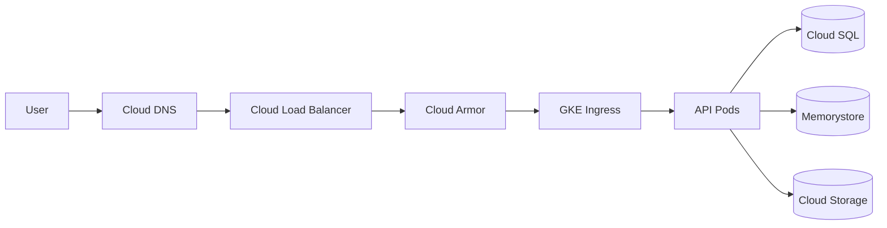

# Infrastructure & Deployment

## 1. Cloud provider & regions

- **Primary provider**: Google Cloud Platform (GCP)
- **Primary region**: `asia-south1` (Mumbai) for India data residency.
- **Failover region**: `asia-south2` (Delhi) or `asia-east1` (Taiwan) for DR.
- **Multi-region readiness**: Terraform modules parameterized by region.

## 2. Network



- **VPC**: Custom VPC with public and private subnets across 3 zones.
- **Private GKE cluster**: nodes in private subnets; control plane accessible via authorized networks only.
- **Cloud NAT** for outbound internet from private nodes.
- **Private Service Connect** for Cloud SQL and Redis.
- **VPC Service Controls** to restrict data exfiltration.

## 3. Compute

- **GKE Standard or Autopilot**: Kubernetes 1.28+
- **Namespaces**:
  - `fhv-prod`
  - `fhv-staging`
  - `fhv-dev`
- **Workloads**:
  - `api` deployment (NestJS)
  - `ai` deployment/consumer (background worker)
  - `admin` deployment (NestJS admin API)
  - `web` deployment (Next.js via custom server or static export)
  - `admin-web` deployment (Next.js)
- **Horizontal Pod Autoscaler**: CPU 60%, memory 70%, custom metrics for queue depth.
- **Vertical Pod Autoscaler** recommendations in dev/staging.

## 4. Database

- **Cloud SQL PostgreSQL 15+** with HA (regional) and read replicas.
- **PgBouncer** or Cloud SQL Auth Proxy for connection pooling.
- **Daily automated backups** + point-in-time recovery.
- **Read replicas** in failover region for DR.
- **Migrations** run as Kubernetes Job during deployment.

## 5. Cache & queue

- **Cloud Memorystore Redis 7.x** in cluster mode.
- Uses:
  - User/family membership cache (TTL 5 min)
  - Rate limit counters (sliding window)
  - AI job queue (Redis Streams)
  - FTS result cache (TTL 1 min)
  - Session store (if not using Supabase sessions)

## 6. Object storage & CDN

- **Cloud Storage** buckets:
  - `fhv-documents-prod` (original files)
  - `fhv-documents-thumbnails-prod`
  - `fhv-exports-prod`
  - `fhv-backups-prod`
- **Object versioning** enabled for accidental deletion recovery.
- **Lifecycle rules**: move to Nearline after 1 year, Coldline after 3 years, delete soft-deleted after retention.
- **Cloud CDN** for signed download URLs and thumbnails.

## 7. Security services

- **Cloud Armor**: WAF rules, rate limiting, DDoS, geo-blocking.
- **Cloud KMS**: CMEK for SQL and Storage; envelope encryption for secrets.
- **Secret Manager**: Supabase keys, DB credentials, Gemini API key.
- **Workload Identity**: map KSA to GSA; no static service account keys.
- **Cloud IAP**: for admin access to internal dashboards.

## 8. Observability

- **Cloud Logging**: application logs, audit logs, infrastructure logs.
- **Cloud Monitoring**: dashboards, alerts, SLOs.
- **Cloud Trace**: distributed tracing (OpenTelemetry).
- **Cloud Profiler**: continuous profiling.
- **Error Reporting**: aggregated errors with PII redaction.

## 9. CI/CD (GitHub Actions)

### Pull request pipeline
- Lint / typecheck / unit tests for each app/service.
- Security scans (SAST, dependency, secrets, container image).
- Terraform plan.

### Main branch pipeline
- Build container images for `api`, `ai`, `web`, `admin-web`.
- Push to Google Artifact Registry.
- Run migrations as a Kubernetes Job.
- Deploy to staging with Helm.
- Smoke tests.
- Manual or automatic promotion to production.

### Deployment strategy
- Rolling updates for API/web.
- Canary for high-risk changes.
- AI workers scaled by queue depth.

## 10. Disaster recovery

| Item | Target |
|---|---|
| RPO | 24 hours (daily backups + point-in-time recovery) |
| RTO | 4 hours |
| Backups | Daily automated + cross-region copy |
| Failover | Manual DB failover; automated traffic shift via DNS/Load Balancer |
| Object storage | Dual-region or cross-region replication |

## 11. Cost controls

- GKE Autopilot for dev/staging; Standard for predictable production scaling.
- Cloud Storage lifecycle to Nearline/Coldline.
- BigQuery audit sink partitioned and queried selectively.
- Reserved instances / committed use discounts for baseline load.
- Per-family AI quotas and CDN bandwidth monitoring.

## 12. Kubernetes manifest layout

```text
infrastructure/kubernetes/
├── base/
│   ├── api-deployment.yaml
│   ├── ai-deployment.yaml
│   ├── web-deployment.yaml
│   ├── ingress.yaml
│   ├── service.yaml
│   └── configmap.yaml
├── overlays/
│   ├── dev/
│   ├── staging/
│   └── prod/
└── helm/
    └── family-health-vault/
```

## 13. Terraform layout

```text
infrastructure/terraform/
├── modules/
│   ├── vpc/
│   ├── gke/
│   ├── cloudsql/
│   ├── redis/
│   ├── storage/
│   ├── iam/
│   └── dns/
├── environments/
│   ├── dev/
│   ├── staging/
│   └── prod/
└── main.tf
```